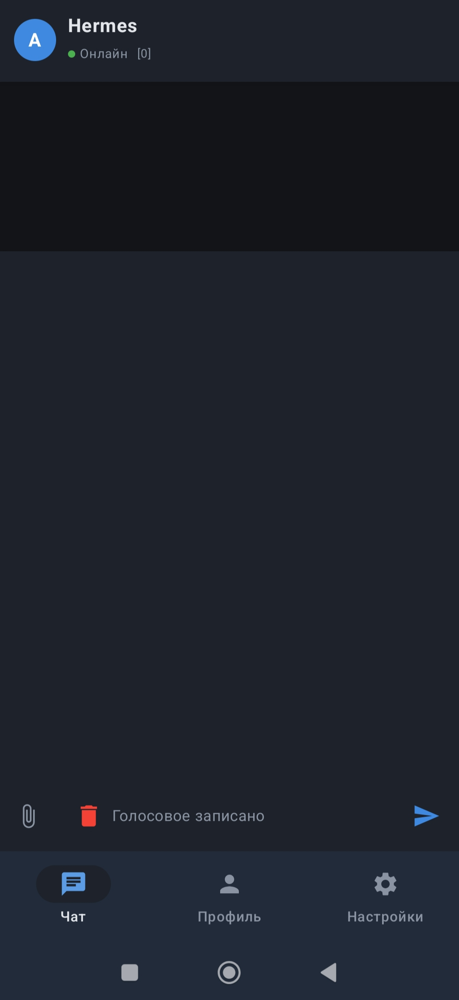
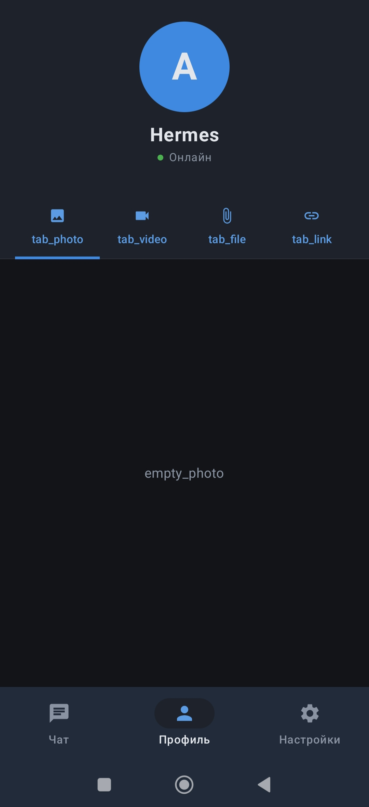
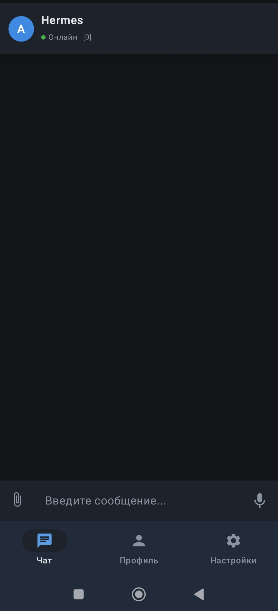
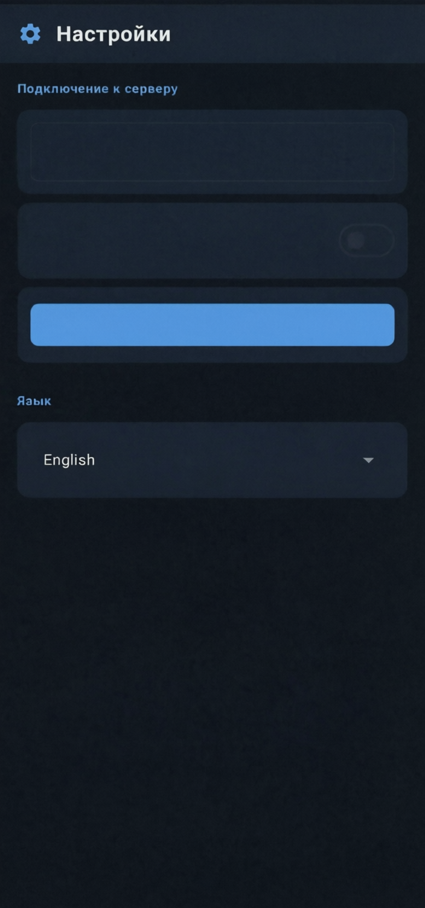

# Hermes Client for Edge-AI Infrastructure

[](https://kotlinlang.org)
[](https://developer.android.com)
[](https://python.org)
[](https://tailscale.com)
[](LICENSE)

Offline-first Android client for communicating with local AI orchestrators over private WireGuard tunnels. Built for air-gapped and intermittent-connectivity environments: smart homes, field inspection, edge compute nodes behind NAT.


## Architecture

```
[Compose UI] <-- Flow <-- [Room DB] <-- [SyncService] --> Tailscale P2P --> Flask API :5001 --> AI orchestrator :8642
```

- UI renders from local Room DB. No network calls in the view layer.
- `SyncService` runs as a foreground service, drains the pending queue, long-polls for responses.
- Server is never exposed to the public internet. All traffic goes over Tailscale/WireGuard.

### Data flow

1. User submits input -> Room DB insert (status `PENDING`)
2. UI recomposes from Flow, displays message immediately
3. `SyncService` picks up `PENDING` rows on next cycle, sends via HTTP
4. Server processes request (STT -> AI -> TTS), writes response to SQLite
5. `SyncService` long-polls `/api/messages?since=N`, fetches AI reply
6. Room DB insert (status `SENT`), UI recomposes

### Idempotency

Every message gets a `client_uuid` (generated client-side, `UNIQUE` constraint on server). Retries use `INSERT OR IGNORE`. Duplicates are silently dropped. Safe to retry indefinitely.

## Stack

**Client (Android)**
- Kotlin 2.0, Jetpack Compose (Material 3)
- Room 2.6.1 (SQLite), StateFlow, ViewModel
- OkHttp 4.12 — two connection pools: commands (fast) and attachments (long timeouts)
- Coil 2.6 for image loading
- Foreground Service (`dataSync` type) for background sync

**Server (Python)**
- Flask + Waitress on port 5001
- SQLite for message persistence
- whisper.cpp (Vulkan GPU, ggml-base) for speech-to-text
- Qwen3-TTS / Piper for text-to-speech
- OpenAI-compatible `/v1/chat/completions` for AI orchestration

## Screenshots

| Chat | Settings | Profile | Home |
|---|---|---|---|
|  |  |  |  |
---

## Setup

### Prerequisites

- Python 3.10+, JDK 17, Android SDK 34
- Tailscale installed on host and mobile device

### Server

```bash
git clone https://github.com/YOUR_USER/hermes-client.git
cd hermes-client/server
cp config.json.example config.json    # add your API keys
pip install -r requirements.txt
python3 server.py                     # listens on 0.0.0.0:5001
```

### Android client

```bash
cd hermes-client/android
# Edit AppConfig.kt:
#   BASE_URL = "http://YOUR_HOST_IP:5001/"
#   API_TOKEN=***
./gradlew assembleDebug
adb install app/build/outputs/apk/debug/app-debug.apk
```

### Tailscale

```bash
sudo tailscale up    # on host
# Open Tailscale app on device, connect to same tailnet
```

Set `BASE_URL` to the host's Tailscale address (`100.x.x.x`).

## API

| Method | Endpoint | Auth | Purpose |
|---|---|---|---|
| `GET` | `/api/status` | Bearer | Health check |
| `POST` | `/api/send` | Bearer | Send text: `{text, client_uuid?}` |
| `POST` | `/api/upload` | Bearer | Multipart upload: `file` + `client_uuid` |
| `GET` | `/api/messages?since=N&timeout=S` | Bearer | Long-poll |
| `GET` | `/api/messages/latest?count=N` | Bearer | Last N messages |
| `GET` | `/api/agent/status` | Bearer | Orchestrator state |
| `GET` | `/api/messages/attachments?type=T` | Bearer | Filter: photo/video/voice/file/link |

## Layout

```
android/
  app/src/main/java/com/hermes/messenger/
    MainActivity.kt            Chat UI, media capture, voice input
    ChatViewModel.kt           Offline-first dispatch
    HermesSyncService.kt       Background sync, multipart uploads
    AppConfig.kt               Endpoint URL, timeouts, pool config
    Theme.kt                   Dark theme (Material 3)
    LocaleHelper.kt            RU/EN strings
    data/
      AppDatabase.kt           Room entities, DAO, migrations
      HermesRepository.kt      Single source of truth

server/
  server.py                    Flask API, STT, TTS, AI bridge
  config.json.example          Template config
  requirements.txt             Dependencies
  test_api.py                  Smoke test
```

## Why offline?

This tool is used in environments where connectivity is unreliable by design:

- Basement server rooms, industrial sites, concrete-walled buildings
- Field operators moving between locations with a mobile device
- Private clouds with intentional network isolation
- Edge nodes behind NAT with no inbound ports open

Room DB acts as a local write-ahead log. Messages are durable regardless of network state. SyncService drains the queue when the overlay link is available. No data is lost on connection drop.

## License

MIT
